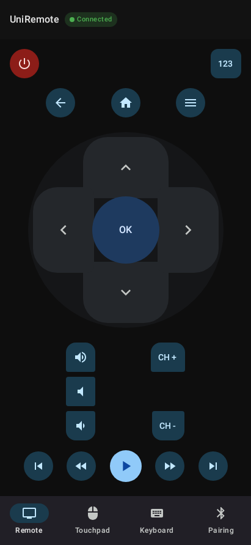

# UniRemote

UniRemote turns an Android phone or tablet into a capable TV remote. It uses Bluetooth
Classic HID first, so the phone behaves like a keyboard, mouse, and consumer-control
peripheral—no companion app is required on the TV. Network control is available when
Bluetooth HID is unsuitable, including Roku and Wake-on-LAN power-on.



## Features

- D-pad, Back, Home, Menu, volume, channel, media, numeric, and power controls
- Touchpad with primary/secondary click, scrolling, and adjustable speed
- Keyboard text input and quick editing keys
- Bluetooth pairing, saved TVs, LAN discovery, and manual IP/brand setup
- Capability-aware controls: unsupported actions are hidden or disabled instead of being
  sent to a TV that cannot use them
- Responsive layouts for phones, tablets, foldables, and landscape use

## Connection options

| Connection | Best for | Notes |
|---|---|---|
| Bluetooth Classic HID | Android TV, Google TV, Fire TV, Samsung, LG, and other TVs that accept a Bluetooth keyboard/mouse | The primary route. Pair the phone from the TV's accessory settings, then select the paired TV in UniRemote. |
| Roku ECP over Wi-Fi | Roku TVs and players | Roku does not accept generic Bluetooth HID. UniRemote discovers Roku on the local network and uses its ECP endpoint. |
| Samsung Tizen / LG webOS over Wi-Fi | TVs that expose their respective network-control APIs | The TV may ask you to approve the initial connection. |
| Wake-on-LAN | Cold power-on for a compatible TV | Requires the TV's MAC address, an enabled WoL/fast-start setting on the TV, and a network that permits broadcast packets. A MAC-only generic entry intentionally exposes only **Power On**. |

Network discovery and control require the phone and TV to be on the same local network.
TV firmware, settings, and manufacturer behavior ultimately determine which controls work;
validate the intended hardware before treating a transport as supported.

## Get started

1. Install UniRemote on an Android 9 (API 28) or newer device with Bluetooth.
2. Open **Pairing** and grant the requested Bluetooth and notification permissions.
3. For Bluetooth control, put the TV into its “add accessory” / Bluetooth keyboard pairing
   mode, pair the phone, then select it under **Paired Bluetooth Devices**.
4. For network control, connect both devices to the same LAN. Choose **Scan** to find a TV,
   or use **Add TV by IP / Brand (Wi-Fi)** for a manual setup.
5. Use the Remote, Touchpad, and Keyboard tabs. Controls available for the active transport
   are shown automatically.

For a Wake-on-LAN-only setup, add the TV with its MAC address and select `GENERIC` or
`UNKNOWN`; an IP address is not required for that power-on-only entry.

## Build from source

### Requirements

- JDK 21 for the checked-in Gradle daemon configuration
- Android SDK Platform 35 / Build Tools installed through Android Studio or `sdkmanager`
- An Android device or emulator running API 28 or later

```sh
git clone <repository-url>
cd UniversalTvRemote

./gradlew assembleDebug
```

The debug APK is written to `app/build/outputs/apk/debug/`.

### Quality checks

```sh
./gradlew test                  # JVM unit tests across all modules
./gradlew lintDebug             # Android lint
./gradlew verifyRoborazziDebug  # Compose screenshot regression tests
./gradlew assembleDebug         # Debug APK
./gradlew :app:connectedDebugAndroidTest  # Device-backed pairing journey
```

The journey test requires a connected device or emulator. It adds a `GENERIC` TV with only
a MAC address, connects it, and verifies that Wake-on-LAN power-on is available.

The Gradle daemon is pinned to JDK 21 in
[`gradle/gradle-daemon-jvm.properties`](gradle/gradle-daemon-jvm.properties). If you change
that file, stop the daemon before the next build:

```sh
./gradlew --stop
```

## Project structure

```text
:app                  Application entry point and responsive Compose shell
:feature:pairing      Device discovery, saved TVs, and connection UI
:feature:remote       Remote-control surface
:feature:touchpad     Pointer and scroll controls
:feature:keyboard     Text input controls
:data:session         Transport selection, persistence, and session lifecycle
:transport:api        Transport contracts and capability vocabulary
:transport:bthid      Bluetooth Classic HID implementation
:transport:network    Roku, Tizen, webOS, discovery, and Wake-on-LAN
:core:model           Shared targets, keys, and pointer models
:core:ui              Reusable controls, theme, and adaptive layout utilities
```

Features depend on `:data:session`, not concrete transports. That separation lets the UI
react to each transport's declared capabilities without hard-coding brand-specific behavior.

## Hardware validation

Automated tests cannot confirm a TV's Bluetooth pairing UX, vendor API prompts, or cold boot
behavior. Before a release, run the physical-device checklist in
[`docs/hardware-validation.md`](docs/hardware-validation.md) for every target TV and record
the model and firmware tested.

## Known limitations

- Bluetooth HID supports one active host connection in practice.
- Roku is network-only; it does not accept the generic Bluetooth HID profile.
- Network power-on is not guaranteed: the TV must support Wake-on-LAN and remain reachable
  from the local network while off.
- Bluetooth HID text input is limited to characters representable by a hardware keyboard.

## License

Copyright 2026 UniversalTvRemote contributors. Licensed under the
[Apache License 2.0](LICENSE).
